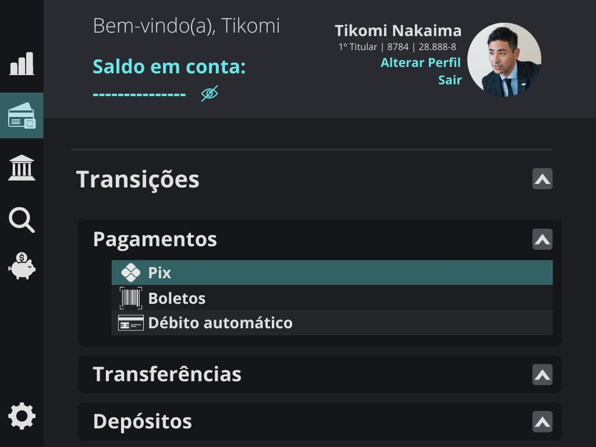

# BitBank

## Sumário
1. [About](#about)
2. [Technologies used](#technologies-used)
3. [Deploy](#deploy)
4. [Contact](#contact)
5. [Settings](#settings)

## About
This is a banking simulator. It is intended to create most of the functionalities existing in a website of this genre, such as account creation, transfers, deposits, withdrawals and others.
In this application, it will be possible to carry out all these actions and interact with other Bit Bank users in the same way as you would in a normal bank, just having the identifier of the person with whom you want to carry out the transactions.

Everything will be stored in a database in the cloud, this database being MongoDB.
Sensitive information, such as passwords for example, will be encrypted so that no one has access to your information.
It is also intended to create SSL encryption for the secure transaction of packages (something similar to HTTPS) between the Front-end and the Back-end; to ensure the security of user accounts, we will also have two-factor login validation, password change via email messages and other features.

The project will have unit, integration and E2E tests to maximize the perfect functionality of the entire application, in addition to having great accessibility (except for paid plugins) and a 100% responsive development for all screen sizes. That is, there is a great focus on SEO, even though it is a project purely focused on studies and portfolio.

Some technologies will be used in the project, among them: Angular (16.1.4), Node.js (18.16.1), Express (4.18.2) and other technologies.
Initially, the structure of the API (made in Express) used to connect the Front-end with the Database will be in JavaScript, while the Angular application will be in TypeScript. It is intended, in the future, to migrate the entire application to work 100% in TypeScript.

## Technologies
### Front-End

### Back-End

### Versioning

### Operational System

## Deploy
Here are the deploy links

## Contacts
Here are the contact

## Settings
Here are the settings
